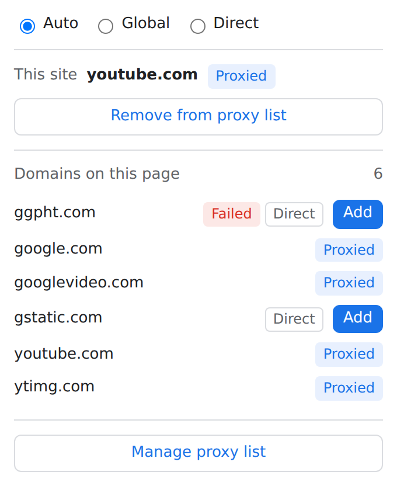
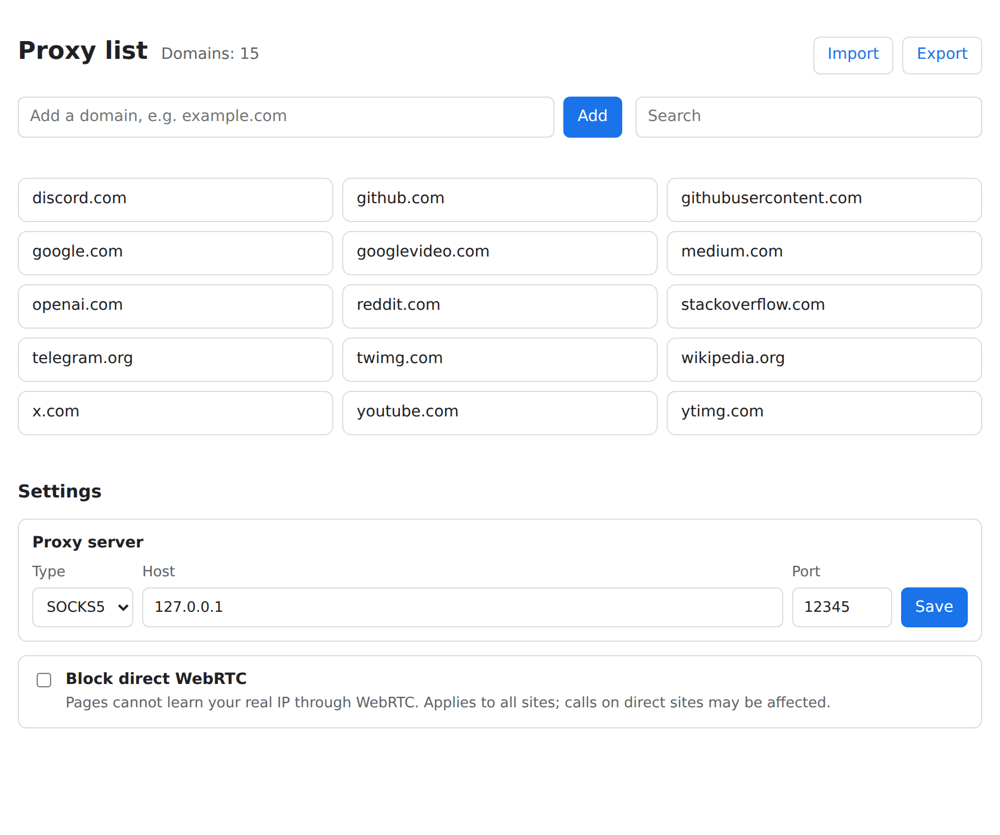

# Detour

**English** · [简体中文](README.zh-CN.md)

A small Chrome extension that sends the domains you choose through your local proxy and lets everything else connect directly.

If you run a local proxy (GOST, Clash, v2rayN, sing-box, …) and only want "these sites through the proxy, the rest direct", Detour does that one thing and stays out of the way.

<p>
  
  
</p>

## Features

- **Three modes**: Auto (listed domains and all their subdomains use the proxy), Global (everything except localhost and LAN addresses), Direct.
- **SOCKS5 or HTTP proxy**, set on the options page. Default: SOCKS5 `127.0.0.1:12345`. Proxied hostnames are resolved by the proxy, not locally.
- **One-click add**: the popup shows whether the current site is proxied and adds or removes its registrable domain (`mail.google.com` → `google.com`, `www.google.com.hk` → `google.com.hk`, using the Public Suffix List).
- **Domains on this page**: every domain the page requested, marked Proxied, Direct or Failed, each with an Add button. Useful for catching the CDN or API domain that keeps a site from loading.
- **Badge count** (Auto mode): how many domains on the current page still go direct; red when one of them failed.
- **No silent fallback**: if the proxy is down, proxied pages fail instead of quietly going direct. The icon shows a red `!` and the popup shows when it last failed.
- **Proxy list page**: search, add, remove with undo, import and export (one domain per line).
- **Block direct WebRTC** (optional): keeps pages from learning your real IP through WebRTC.
- English and Simplified Chinese UI, following the browser language.

Detour does not intercept requests; routing is handled by Chrome's own proxy settings (a PAC script or fixed servers), so it adds no measurable delay to page loads. Everything stays in your browser: no accounts, no sync, no network calls of its own.

## Install

1. Download `detour-<version>.zip` from [Releases](https://github.com/xaya1001/detour/releases).
2. Unzip it into a folder you will keep. Chrome loads the extension from that folder, so deleting it removes the extension.
3. Open `chrome://extensions`, turn on **Developer mode**, click **Load unpacked** and choose the folder (the one containing `manifest.json`).
4. Pin Detour to the toolbar. Open **Manage proxy list → Settings** to set your proxy if it is not SOCKS5 `127.0.0.1:12345`.

To update, unzip the new version over the same folder and click the reload button on the Detour card in `chrome://extensions`. Your list and settings are kept.

Chrome lets only one extension control the proxy at a time. If the popup says another extension controls the proxy settings, disable the other proxy extension.

## Badge

| Badge | Meaning |
| --- | --- |
| `A` | Auto mode, nothing on this page goes direct |
| `2` (gray) | Auto mode, 2 domains on this page go direct |
| `2` (red) | …and at least one of them failed to load |
| `G` | Global mode |
| none | Direct mode |
| `!` (red) | The proxy could not be reached |

## Development

Requires Node.js 22+. The extension itself has no dependencies and no build step; Playwright is used only for end-to-end tests.

```sh
npm ci
npx playwright install chromium
npm test            # unit tests
npm run check       # unit + end-to-end tests in Chromium (offline, uses port 12345)
npm run package     # dist/detour-<version>.zip
npm run update-psl  # refresh the bundled Public Suffix List
```

Releases are built by GitHub Actions when a `v<version>` tag matching `extension/manifest.json` is pushed.

## License

[MIT](LICENSE). Bundles data from the [Public Suffix List](https://publicsuffix.org/) under the [MPL 2.0](https://mozilla.org/MPL/2.0/).
