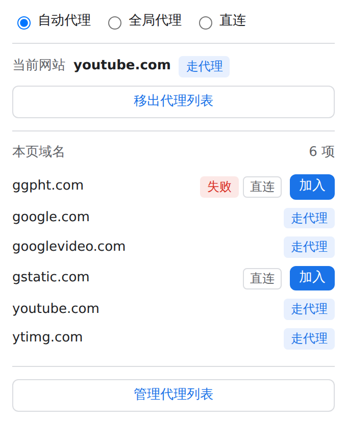
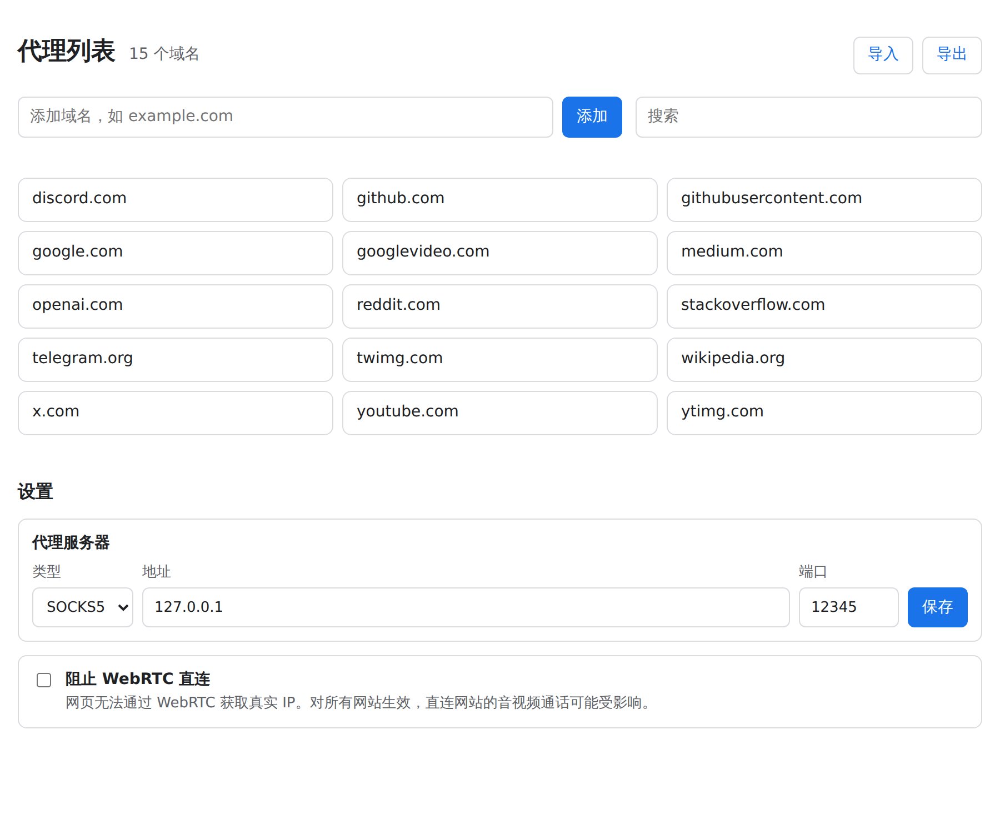

# Detour

[English](README.md) · **简体中文**

一个小巧的 Chrome 扩展：让你指定的域名经本地代理访问，其余网址直连。

如果你在本机运行代理（GOST、Clash、v2rayN、sing-box 等），只需要"这些网站走代理、其他直连"，Detour 只做这一件事。

<p>
  
  
</p>

## 功能

- **三种模式**：自动代理（列表中的域名及其全部子域名走代理）、全局代理（除本机和局域网地址外全部走代理）、直连。
- **SOCKS5 或 HTTP 代理**，在管理页设置，默认 SOCKS5 `127.0.0.1:12345`。被代理的域名由代理端解析，不在本地做 DNS 查询。
- **一键加入**：弹窗显示当前网站是否走代理，并可加入或移出它的主域名（按公共后缀列表计算：`mail.google.com` → `google.com`，`www.google.com.hk` → `google.com.hk`）。
- **本页域名**：列出当前页面请求过的全部域名，标明走代理、直连或失败，每项都可一键加入。网页缺图、加载不全时，用它找出漏掉的 CDN 或接口域名。
- **角标计数**（自动代理模式）：当前页面仍在直连的域名个数；其中有加载失败时显示为红色。
- **不偷偷回退直连**：代理不可用时，被代理的网页直接打不开，图标显示红色 `!`，弹窗显示最近失败时间。
- **代理列表管理页**：搜索、添加、删除（可撤销）、导入导出（每行一个域名）。
- **阻止 WebRTC 直连**（可选）：防止网页通过 WebRTC 获取真实 IP。
- 中英文界面，跟随浏览器语言。

Detour 不拦截请求，分流由 Chrome 自身的代理设置（PAC 脚本或固定代理）完成，不会拖慢网页加载。所有数据只保存在你的浏览器里：没有账号、没有同步，扩展自身不发起任何网络请求。

## 安装

1. 从 [Releases](https://github.com/xaya1001/detour/releases) 下载 `detour-<版本>.zip`。
2. 解压到一个长期保留的目录。Chrome 从该目录加载扩展，删除目录扩展就会失效。
3. 打开 `chrome://extensions`，开启右上角**开发者模式**，点击**加载已解压的扩展程序**，选择解压后的目录（含 `manifest.json`）。
4. 把 Detour 固定到工具栏。如果你的代理不是 SOCKS5 `127.0.0.1:12345`，在**管理代理列表 → 设置**中修改。

升级时把新版本解压覆盖到同一目录，然后在 `chrome://extensions` 的 Detour 卡片上点击刷新按钮，列表和设置都会保留。

Chrome 同一时间只允许一个扩展控制代理。如果弹窗提示代理设置由其他扩展控制，请停用其他代理扩展。

## 角标

| 角标 | 含义 |
| --- | --- |
| `A` | 自动代理，本页没有直连的域名 |
| `2`（灰色） | 自动代理，本页有 2 个域名直连 |
| `2`（红色） | ……其中至少一个加载失败 |
| `G` | 全局代理 |
| 无 | 直连 |
| `!`（红色） | 代理连接失败 |

## 开发

需要 Node.js 22+。扩展本身没有依赖、无需构建；Playwright 只用于端到端测试。

```sh
npm ci
npx playwright install chromium
npm test            # 单元测试
npm run check       # 单元测试 + Chromium 端到端测试（离线，占用 12345 端口）
npm run package     # 生成 dist/detour-<版本>.zip
npm run update-psl  # 更新内置的公共后缀列表
```

推送与 `extension/manifest.json` 版本一致的 `v<版本>` tag 后，GitHub Actions 自动构建并发布 Release。

## 许可证

[MIT](LICENSE)。内置的 [Public Suffix List](https://publicsuffix.org/) 数据采用 [MPL 2.0](https://mozilla.org/MPL/2.0/) 许可。
